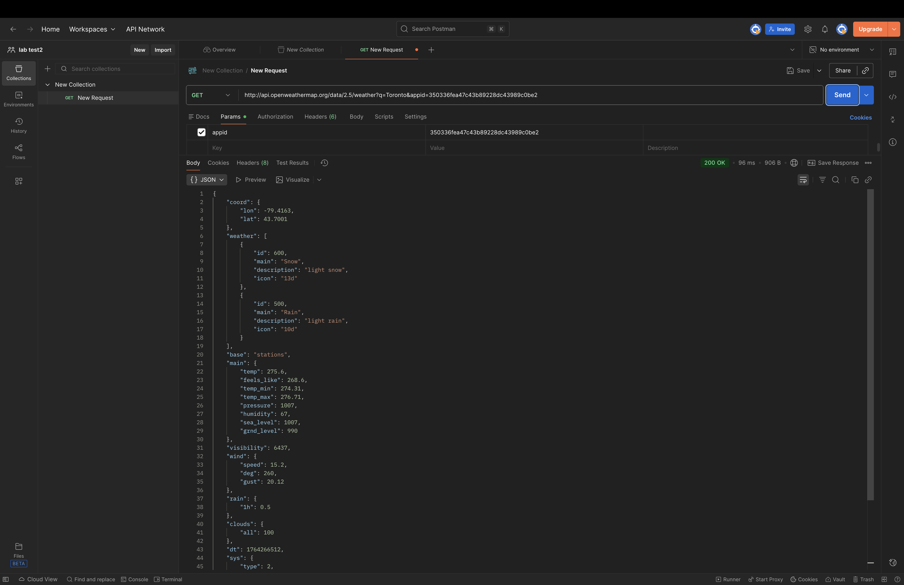

# Weather Forecast Application

**Student ID:** 101491591  
**Course:** COMP3123 - Full Stack Development I  
**Lab Test:** 2 (Week 13)

## 📱 Project Description

A modern, responsive weather application built with React that displays current weather conditions and a 5-day forecast for any city worldwide. The app features a premium glassmorphism design with smooth animations and real-time data from the OpenWeatherMap API.

## 🚀 Features

- **Real-time Weather Data** - Current weather conditions for any city
- **5-Day Forecast** - Extended weather predictions
- **Dynamic Search** - Search weather by city name
- **Comprehensive Weather Info** - Temperature, humidity, wind speed, pressure, visibility, feels like, and sunrise time
- **Responsive Design** - Works seamlessly on desktop and mobile devices
- **Premium UI/UX** - Modern glassmorphism design with smooth animations
- **Weather Icons** - Dynamic weather condition icons from OpenWeatherMap

## 🛠️ Technologies Used

- **React.js** - Frontend framework
- **JavaScript (ES6+)** - Programming language
- **CSS3** - Styling with animations and glassmorphism effects
- **OpenWeatherMap API** - Weather data provider
- **Fetch API** - HTTP requests

## 📡 API Used

**OpenWeatherMap API**
- Current Weather Endpoint: `http://api.openweathermap.org/data/2.5/weather`
- 5-Day Forecast Endpoint: `http://api.openweathermap.org/data/2.5/forecast`
- Documentation: https://openweathermap.org/api

## 📦 Installation & Setup

### Prerequisites
- Node.js (v16 or higher)
- npm or yarn
- Git

### Steps

1. **Clone the repository**
```bash
git clone https://github.com/YOUR_USERNAME/101491591_comp3123_labtest2.git
cd 101491591_comp3123_labtest2
```

2. **Install dependencies**
```bash
npm install
```

3. **Start the development server**
```bash
npm start
```

4. **Open in browser**
```
http://localhost:3000
```

## 📁 Project Structure
```
101491591_comp3123_labtest2/
├── public/
│   └── index.html
├── src/
│   ├── components/
│   │   ├── SearchBar.js          # Search input component
│   │   ├── WeatherCard.js        # Main weather display
│   │   └── WeatherDetails.js     # Detailed info & forecast
│   ├── App.js                    # Main application component
│   ├── App.css                   # Application styling
│   └── index.js                  # Entry point
├── package.json
└── README.md
```

## 🎨 Design Features

- **Glassmorphism Effects** - Frosted glass appearance with backdrop blur
- **Animated Background** - Dynamic gradient with shifting colors
- **Smooth Transitions** - Cubic bezier easing for professional feel
- **Hover Effects** - Interactive elements with scale and translate
- **Floating Animations** - Weather icon with gentle floating motion
- **Responsive Layout** - Grid system adapts to screen sizes

## 📸 Screenshots

### Main Weather Display

*Current weather with temperature, location, and condition*

### Weather Details

*Comprehensive weather information grid*

### 5-Day Forecast

*Extended weather predictions*

### Search Functionality

*Dynamic city search feature*

### Postman API Testing

*API endpoint testing in Postman*

## 🌐 Live Deployment

**Deployed on Vercel:** [Your Vercel URL will go here]

## 🔑 React Concepts Demonstrated

### State Management (useState)
- Managing weather data
- Handling loading states
- Error state management
- User input tracking

### Effects (useEffect)
- Fetching data on component mount
- API calls on search

### Props
- Passing weather data from parent to child components
- Event handler props for search functionality

### Component Composition
- Modular component architecture
- Reusable components

## 📝 Assignment Requirements Checklist

- [x] ReactJS application with correct naming convention
- [x] Connected to GitHub repository
- [x] Weather icons from OpenWeatherMap
- [x] Custom UI/UX design
- [x] Search/dynamic content feature
- [x] Display all relevant weather information
- [x] README.md with documentation
- [x] Hosted on deployment platform
- [x] Postman API testing
- [x] Screenshots of all outputs

## 🐛 Known Issues / Assumptions

- API calls are limited to 60 per minute on free tier
- Forecast data shows 5 days based on available API data
- Temperature displayed in Celsius (metric system)
- Times shown in local browser timezone

## 👨‍💻 Author

**Student ID:** 101491591  
**Program:** Computer Science  
**Institution:** George Brown College

## 📄 License

This project is created for educational purposes as part of COMP3123 coursework.

## 🙏 Acknowledgments

- OpenWeatherMap for providing free weather API
- George Brown College - COMP3123 Course
- React.js documentation and community